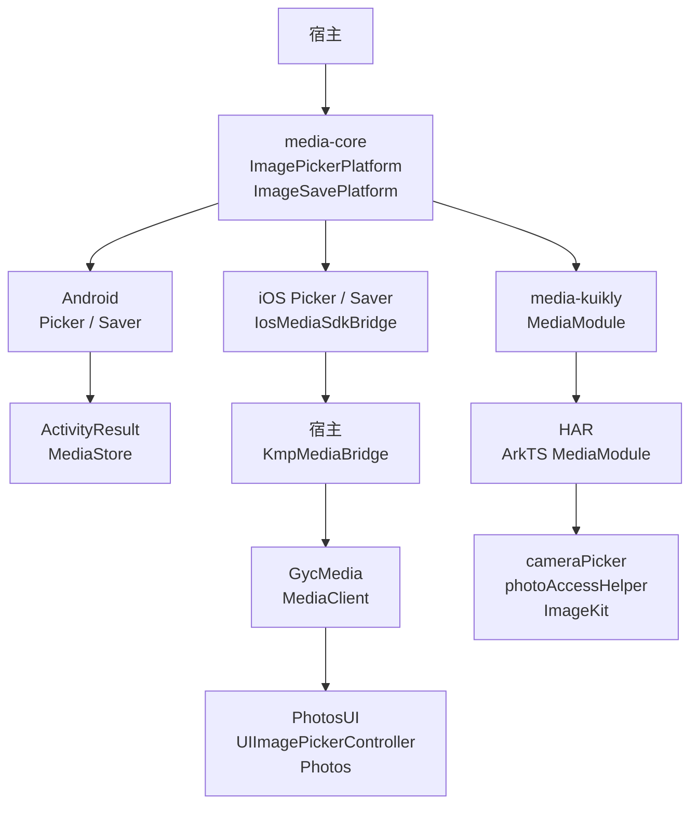
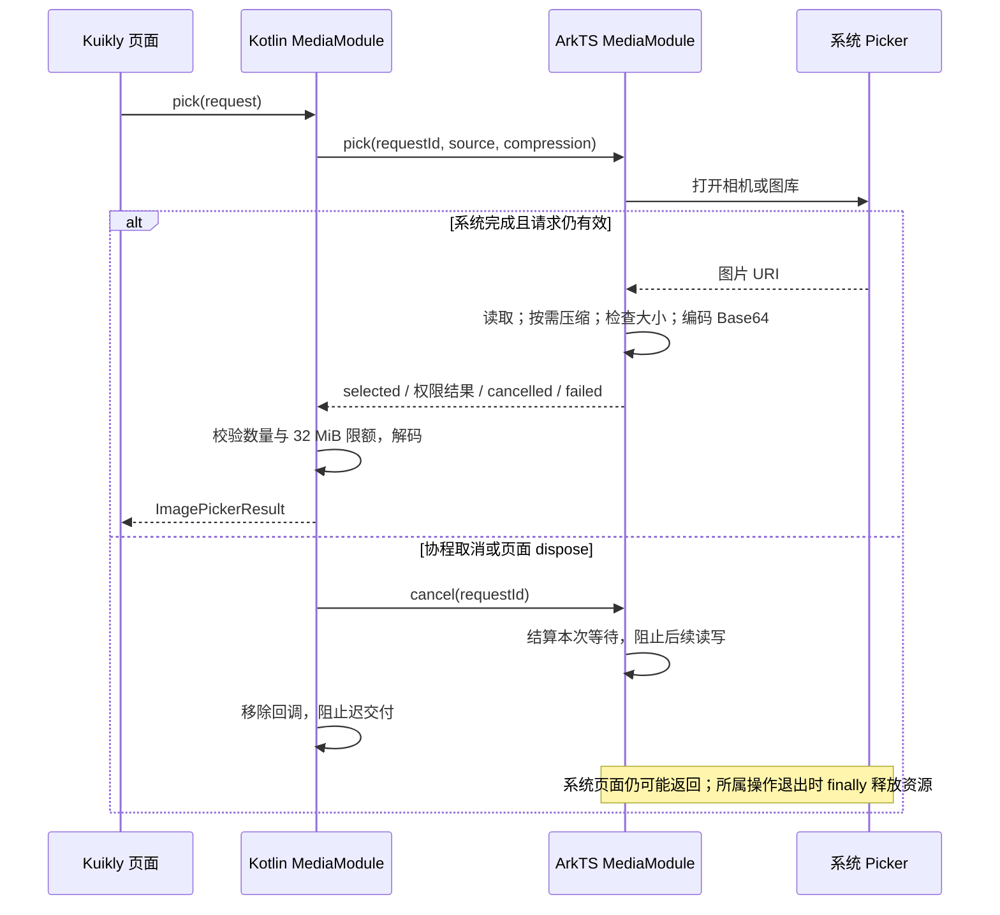
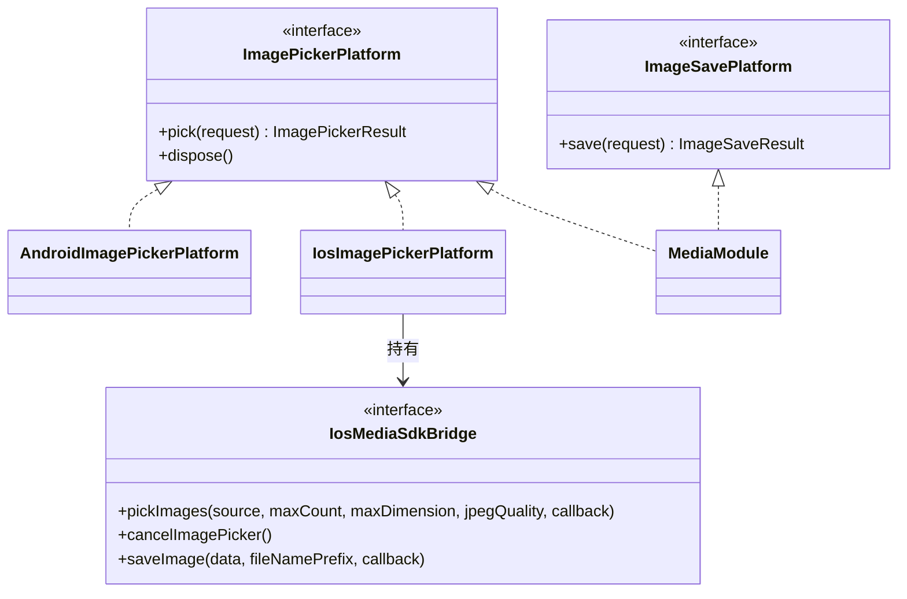

# GY CrossKit Media

系统选图、拍照、可选 JPEG 压缩和保存相册。返回图片编码字节、文件名与 MIME；上传、业务大小限制和页面提示由宿主负责。

Maven 预发行 `0.1.4` 已发布，修复 Android/iOS Picker 的线程、取消与释放交付边界。Android 5 项、iOS Simulator 6 项测试通过，完整 Maven 归档、公开 Release 下载 SHA 和 JitPack 制品审计通过，结果见 [0.1.4 远程发布验收](docs/0.1.4远程发布验收.md)。

| 渠道 | 配套版本 | 状态 |
| --- | --- | --- |
| Maven core/Kuikly | 0.1.4 | 预发行已发布；JitPack 制品审计通过 |
| Swift Package GycMedia | 0.1.2 | Swift 原生源码未变，保留已验证版本 |
| HarmonyOS HAR | 0.1.3 | 保留已验证 Release HAR；Registry 可安装状态独立核对 |

0.1.3 标签只提供 HAR；Maven 历史版本为 0.1.2，当前预发行为 0.1.4。

## 平台与要求

| 平台 | 接入方式 | 系统要求 |
| --- | --- | --- |
| Android | KMP `media-core` 原生实现 | API 24+，`ComponentActivity` |
| iOS | KMP + Swift bridge，或 Swift Package `GycMedia` | iOS 14+，Swift tools 5.9 |
| HarmonyOS | `media-kuikly` + `@gycrosskit/media` HAR | 当前 HAR 的 target/compatible SDK 均为 API 22 |

KMP 使用 Kotlin `2.2.21-1.0.0`、coroutines `1.10.2-1.0.0`，Kuikly 使用 `2.28.0-2.0.21-ohos`；OHOS 宿主需匹配工具链。

## 架构与调用流程

`media-core` 定义选图与保存契约，平台实现负责系统 UI、编码读取及资源收尾。iOS KMP 需要宿主接线 Swift bridge；HarmonyOS Kotlin Module 与 ArkTS Module 同名，分属不同产物。



HarmonyOS 选图使用 requestId 隔离等待与取消；正常结果返回编码字节，宿主决定下一步保存或上传。取消不能强制关闭系统 Picker，原生操作仍需在退出时释放自己的资源。



类图聚焦两种公共能力及选图实现；iOS saver 同样使用 `IosMediaSdkBridge`，Android saver 直接调用 MediaStore。



源码：[选图契约](media-core/src/commonMain/kotlin/io/github/gycrosskit/media/ImagePickerPlatform.kt)、[保存契约](media-core/src/commonMain/kotlin/io/github/gycrosskit/media/ImageSavePlatform.kt)、[Android Picker](media-core/src/androidMain/kotlin/io/github/gycrosskit/media/AndroidImagePickerPlatform.kt)、[Android Saver](media-core/src/androidMain/kotlin/io/github/gycrosskit/media/AndroidImageSavePlatform.kt)、[iOS Picker](media-core/src/iosMain/kotlin/io/github/gycrosskit/media/IosImagePickerPlatform.kt)、[iOS Saver](media-core/src/iosMain/kotlin/io/github/gycrosskit/media/IosImageSavePlatform.kt)、[iOS bridge 契约](media-core/src/iosMain/kotlin/io/github/gycrosskit/media/IosMediaSdkBridge.kt)、[宿主 bridge 示例](iosApp/KmpMediaBridge.swift)、[Swift MediaClient](iosApp/Sources/GycMedia/MediaClient.swift)、[Kotlin MediaModule](media-kuikly/src/commonMain/kotlin/io/github/gycrosskit/media/kuikly/MediaModule.kt)、[ArkTS MediaModule](ohos/media/src/main/ets/MediaModule.ets)。

## 安装

```kotlin
// settings.gradle.kts
dependencyResolutionManagement {
    repositories {
        exclusiveContent {
            forRepository {
                maven("https://mirrors.tencent.com/nexus/repository/maven-tencent/")
            }
            filter { includeGroup("com.tencent.kuikly-open") }
        }
        maven("https://jitpack.io")
        maven("https://maven.eazytec-cloud.com/nexus/repository/maven-public/")
        google()
        mavenCentral()
    }
}
```

Kuikly group 固定从腾讯 Maven 读取 metadata 和实际产物，避免其他镜像先返回 metadata、随后产物缺失时 Gradle 无法切源。此规则只匹配 `com.tencent.kuikly-open`，其他 SDK 的仓库选择保持；本轮检查见 [0.1.4 远程发布验收](docs/0.1.4远程发布验收.md)。

```kotlin
commonMain.dependencies {
    implementation("com.github.gycrosskit.media:media-core:0.1.4")
}
ohosArm64Main.dependencies {
    implementation("com.github.gycrosskit.media:media-kuikly:0.1.4")
}
```

iOS 在 Xcode 的 Package Dependencies 添加 `https://github.com/gycrosskit/media.git`，选择精确版本 `0.1.2`，产品 `GycMedia`。KMP 不自动导入该 Swift Package，桥接步骤见接入指南。

HarmonyOS 原生包独立安装；本轮 Maven 0.1.4 配合已验 HAR 0.1.3，桥接契约兼容。以下 registry 命令需等待审核可见；
审核期间可使用既有 Maven/HAR 0.1.2 配对，或从对应 Release 下载并校验 HAR 后本地安装：

```sh
ohpm install @gycrosskit/media@0.1.3
```

## 最小使用

```kotlin
import io.github.gycrosskit.media.*

// permission 是宿主的 suspend (String) -> MediaPermissionState 权限入口。
val picker = AndroidImagePickerPlatform(activity, permission)
val saver = AndroidImageSavePlatform(activity, permission)
// 绑定页面生命周期的协程内调用：
val result = picker.pick(ImagePickerRequest(
    source = ImagePickerSource.GALLERY,
    maxCount = 3,
    compression = ImageCompression(maxDimension = 2048, jpegQuality = 85),
))
if (result is ImagePickerResult.Selected) {
    val image = result.images.first()
    val saved = saver.save(ImageSaveRequest(image.bytes, fileNamePrefix = "photo"))
}
// 宿主销毁时：
picker.dispose()
```

不传 `compression` 保留原始编码；系统相机只提供 UIImage 时会编码为 JPEG。iOS 构建 `IosImagePickerPlatform(bridge)` / `IosImageSavePlatform(bridge)`；HarmonyOS 注册 `MediaModule`。

## 权限与边界

Android 声明 `CAMERA`；API 28 及以下保存相册还需 `WRITE_EXTERNAL_STORAGE`（`maxSdkVersion="28"`）。系统选图不申请整库读取权限。iOS 填写 `NSCameraUsageDescription`、`NSPhotoLibraryAddUsageDescription`，PHPicker 不读取整库授权，保存请求 `.addOnly`。

取消、拒绝权限、已阻止权限、设备策略限制和失败分开返回。Android/iOS 的新 Picker 替换旧请求；原生平台的 `pick()`、`save()` 和 `dispose()` 可从调用方线程进入，SDK、权限与 Picker 状态由组件切到主线程。`dispose()` 立即撤销已回调但尚未交付的结果，延迟清理只取消释放前的请求；后续新请求仍可正常使用实例。HarmonyOS 系统 Picker 忙时返回失败，Kotlin Module 销毁时 `dispose()`。
新版 Kotlin/HAR 使用 requestId 成对隔离，取消结束自有原生等待、移除回调并阻止后续读写；旧系统 Picker
返回前仍保持忙状态，不承诺强制关闭系统页面。文件、图像 source/pixels/packer 和相册 helper 在所属原生操作
退出时由 finally 释放；不可撤回的系统操作需等待它返回，不复用旧 ID，不让旧 cancel 或迟到结果影响新请求。

HarmonyOS 的 JSON/Base64 桥在 decode 前检查单张和合计 32 MiB，原图文件在读取分配前检查剩余额度，
显式 JPEG 压缩后也检查输出合计再编码。原图不重编码，三类权限结果保持。Android 保存支持 PNG/JPEG/WebP；
iOS/HarmonyOS 按系统图像解码能力识别格式。不提供视频、上传或扫码。真实设备权限、选择器、相册写入与大图内存仍需宿主验收。

## 文档与帮助

- [接入指南](docs/接入指南.md)：平台初始化、权限声明和生命周期。
- [开发与验证](docs/开发与验证.md)：源码构建、检查命令与验收范围。
- [版本与发行说明](https://github.com/gycrosskit/media/releases)、[问题反馈](https://github.com/gycrosskit/media/issues)。

组件源码使用 Apache-2.0，见 [LICENSE](LICENSE)。Kuikly 和平台 SDK 遵循各自许可。

本轮制品校验与远程状态见 [0.1.4 发布验收](docs/0.1.4远程发布验收.md)，历史 HAR 发布记录见 [0.1.3 发布验收](docs/发布验收-0.1.3.md)。
